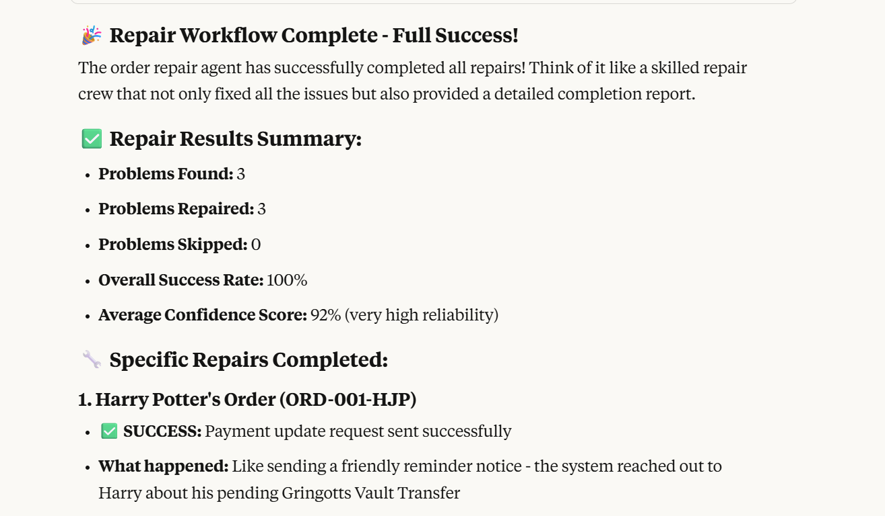

# temporal-multi-agent
Examples showing how to do different styles of multi-agents with Temporal

### Prerequisites:

- Python3+
- `uv` (curl -LsSf https://astral.sh/uv/install.sh | sh)
- Temporal [Local Setup Guide](https://learn.temporal.io/getting_started/?_gl=1*1bxho70*_gcl_au*MjE1OTM5MzU5LjE3NDUyNjc4Nzk.*_ga*MjY3ODg1NzM5LjE2ODc0NTcxOTA.*_ga_R90Q9SJD3D*czE3NDc0MDg0NTIkbzk0NyRnMCR0MTc0NzQwODQ1MiRqMCRsMCRoMA..)
- [Claude for Desktop](https://claude.ai/download)


## 1. Setup

```bash
uv venv
source .venv/bin/activate
# uv pip install temporalio fastmcp

poetry install
```

## 2. Launch Temporal locally

```bash
temporal server start-dev
```

## 3. Start the worker

```bash
poetry run python run_worker.py
```

## 4. Start Various Workflows
### Repair Agent
Repair Agent executes the detect/analyze/repair cycle once:
1. Detects problems
2. Analyzes problems
3. Proposes repairs
4. Waits for approval
5. Executes repairs
6. Reports on its actions
#TODO could make this a diagram
```bash
poetry run python run_repair_agent.py  --auto-approve
```
Optionally you can auto-approve the repairs:
```bash
poetry run python run_repair_agent_periodic.py --auto-approve
```
Or you can approve it using the Temporal UI or included script:
```bash
poetry run python ./approve_repair_for_agent.py --workflow-id "repair-Josh-49c94bb5-d7a6-4a25-a8a3-39f0bf800f91"
```

You can also hook this up to an MCP Client using the included `mcp_server.py`. 
WSL config:
```JSON
    "order_repair_agent": {
      "disabled": false,
      "timeout": 60,
      "type": "stdio",
      "command": "wsl.exe",
      "args": [
        "--cd",
        "/path/to/temporal-multi-agent",
        "--",
        "poetry",
        "run",
        "python",
        "mcp_server.py"
      ]
    }
```
Here's how it looks with Claude:


### Proactive Repair Agent
This proactive agent executes detection and analysis periodically, and notifies if it finds problems. 
It will wait for approval before proceeding with the repair. It _recommends_ repair actions but doesn't do it's own decision making
1. Detects problems
2. Analyzes problems
3. Proposes repairs
4. Notify that there are problems
5. Waits for approval
6. Executes repairs
7. Reports on its actions
8. Wait a day, start again from the top
#todo good to diagram

## 5. Results
#todo talk about the ingredients (detect, analyze, Action, Report)
#todo talk about the styles: single activity, multiple activities, proactive/scheduled, proactive/looping, supervised

#TODO: explain automation agents vs conversational (assistive) agents, and how they can be used together

### What's Cool About This:
#todo talk about long running interactive agents, proactive agents, self-repairing workflows
