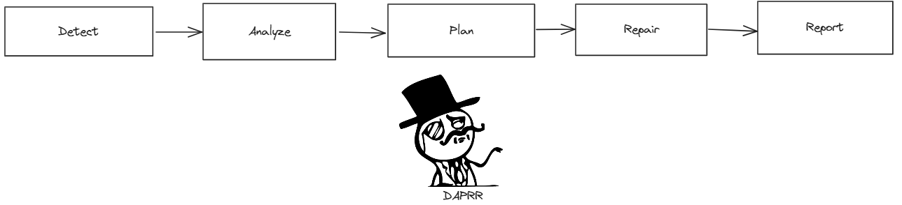
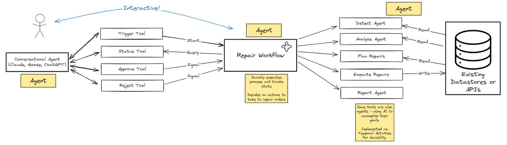

# temporal-multi-agent
Examples showing different styes of multi-agent architecture with Temporal.
These agents are automation agents who accomplish tasks intelligently and independently. 
They are _not_ conversational. These agents are exposed as tools (via MCP) so they can be used 
by an MCP client.

We will demonstrate several kinds of agents:
- a long-lived, interactive agent as MCP tools - TODO link to down below
- simple single-task agents
- a proactive agent 
- a scheduled agent 

## Harry Potter and the School Supplies Problem
Harry, Ron, Hermione and friends want to get supplies for the next year at Hogwarts. 
The orders are in the system ([orders data](./data/orders.json)), and there is an inventory database as well ([inventory](./data/inventory.json)).
Unfortunately, there are a few problems, such as Hagrid trying to buy a Norwegian Ridgeback Dragon Egg that is restricted and requires approval:
```json
{
      "order_id": "ORD-004-RHG",
      "customer_name": "Rubeus Hagrid",
      "status": "pending-approval",
      "items": [
        {
          "item_id": "DRG-EGG-007",
          "item_name": "Dragon Egg - Norwegian Ridgeback",
          "description": "RESTRICTED ITEM: Requires Ministry of Magic approval for purchase - breeding license needed",
          "category": "Magical Creatures - Restricted",
          "quantity": 1,
          "unit_price": 37.98,
          "total_price": 37.98
        }
      ]
    },
```
There are a few other problems, such as Hermione ordering more SPEW badges than are available. 
(Feel free to add more orders with problems, such as Dumbledore ordering something that there isn't enough inventory for, or Voldemort ordering something illegal. You might need to add tools to take action if there aren't repair actions to fix what you add. )

## How it works: DAPRR Magic Repair
This system demonstrates an agentic pattern I call DAPRR: detect, analyze, plan, repair, report:



Automation agents often do this DAPRR sequence, or a subset, such as analysis, planning, and repair. <br />
Notes:
- Detection can often be a less expensive version of analysis, such as getting _if any_ orders need analysis
  - it could be skipped entirely if the system can be notified when there is a problem such as via an event
- *Planning* is a key step - it allows a human to review and approve the plans
- This is a long-running human-in-the-loop agentic process, so it needs durability, interaction, and state (memory). In this sample, we provide that with a Temporal Workflow.

This pattern is applicable to **many kinds** of systems. Anything that a human has to detect, think about, and act on could be simplified with this kind of AI-powered automation. Examples include:
- site reliability / production monitoring
- failed transactions
- IT infrastructure scaling (up or down)
- customer service & support
- any work in a work queue
- nearly anything that isn't as it should be that a human can fix with computers

### Repair System Overview: 

The user interacts with the repair process, can query it for status and what it's doing or proposing to do, and approve repairs.
The tools are executed durably with Temporal - in this case an agentic workflow that takes some steps on its own, using AI.

## Prerequisites:
- Python3+
- `uv` (curl -LsSf https://astral.sh/uv/install.sh | sh)
- Temporal [Local Setup Guide](https://learn.temporal.io/getting_started/?_gl=1*1bxho70*_gcl_au*MjE1OTM5MzU5LjE3NDUyNjc4Nzk.*_ga*MjY3ODg1NzM5LjE2ODc0NTcxOTA.*_ga_R90Q9SJD3D*czE3NDc0MDg0NTIkbzk0NyRnMCR0MTc0NzQwODQ1MiRqMCRsMCRoMA..)
- [Claude for Desktop](https://claude.ai/download), [Goose](https://github.com/block/goose), or maybe [mcp inspector](https://github.com/modelcontextprotocol/inspector)


## 1. Setup
```bash
uv venv
source .venv/bin/activate
poetry install
```

### Launch Temporal locally 
(if using local Temporal, see [.env.example](./.env.example) for other options)
```bash
temporal server start-dev
```

### Set up your .env settings
Copy `.env.example` to `.env` and set your properties, particularly:
```bash
LLM_MODEL=openai/gpt-4o
LLM_KEY=sk-proj-...
```
### Start the worker
```bash
poetry run python run_worker.py
```

## 2. Running
### Repair Agent Tool
The Repair Agent executes the detect/analyze/plan/repair/report cycle once. 
This agent is:
- a *tool* that takes action for an agent
- an *agent* that makes decisions (such as planning & proposing tools)
- an *orchestrator* of other agents (such as the Analysis and Reporting Agents - who are much simpler)
- a Temporal Workflow - dynamically taking action to accomplish the repair 

([related definitions](https://temporal.io/blog/building-an-agentic-system-thats-actually-production-ready#agentic-systems-definitions))

**Note:** It does update the `inventory.json` and `orders.json` data as it repairs. You can look at the data files after it runs to see changes. You can reset the data between runs by discarding the changes it makes and refreshing from the git repo.

#### Terminal
An easy way to understand what it's doing is to kick it off via a terminal:
```bash
poetry run python run_repair_agent.py 
```
Optionally you can auto-approve the repairs:
```bash
poetry run python run_repair_agent.py  --auto-approve
```
Or you can approve it using the Temporal UI or included script:
```bash
poetry run python ./approve_repair_for_agent.py --workflow-id "repair-Josh-49c94bb5-d7a6-4a25-a8a3-39f0bf800f91"
```

Here's what the output looks like:
```none
poetry run python run_repair_agent.py --auto-approve
Client connection: [localhost:7233], Namespace: [default], Task Queue: [agent-repair-task-queue]
Josh's Repair Workflow started with ID: repair-Josh-0a75c9b7-cabe-4339-ba9c-5c8770dc88b0
Current repair status: DETECTING-PROBLEMS
Current repair status: PLANNING-REPAIR
Current repair status: PENDING-APPROVAL
Repair planning is complete.
Proposed Orders to repair:
  - ORD-001-HJP: 
    - request_payment_update_tool: confidence score 0.8 
      - additional_notes: Please deliver after 3 PM to avoid Dursleys
      - customer_id: CUST-HP-001
      - customer_name: Harry James Potter
      - order_id: ORD-001-HJP
      - original_payment_method: Gringotts Vault Transfer
  - ORD-002-HJG: 
    - order_inventory_tool: confidence score 0.95 
      - inventory_description: S.P.E.W. Badge Set
      - inventory_to_order: STP-ORG-001
      - order_id: ORD-002-HJG
      - quantity: 300
  - ORD-003-RBW: 
    - request_payment_update_tool: confidence score 0.9 
      - additional_notes: Maybe short on gold. Can you hold this for a week?
      - customer_id: CUST-RW-003
      - customer_name: Ronald Bilius Weasley
      - order_id: ORD-003-RBW
      - original_payment_method: Gringotts Vault Transfer
  - ORD-004-RHG: 
    - request_approval_tool: confidence score 0.95 
      - approval_request_contents: Request to Approve Order
      - approver: approve-orders@diagonalley.co.uk
      - order_id: ORD-004-RHG
Auto-approval is enabled. Proceeding with repair workflow.
Auto-approving the repair workflow
Current repair status: PENDING-REPAIR
Current repair status: PENDING-REPORT
Workflow completed with result: Repair workflow completed with status: REPORT-COMPLETED. 
Report Summary: The repair process was completed successfully for 4 issues, with no problems skipped. 
Each relevant order received the necessary corrections and updates.
```

There are other scripts included for your convenience:
- [query_repair_agent](./query_repair_agent.py)
- [approve_repair_for_agent](./approve_repair_for_agent.py)

You can follow along with its progress in the Temporal UI Workflow History.

#### MCP
You can also hook this up to an MCP Client using the included `mcp_server.py`. <br />
(You may want to reset the data files between runs to get the same results again.)
WSL config:
```JSON
    "order_repair_agent": {
      "disabled": false,
      "timeout": 60,
      "type": "stdio",
      "command": "wsl.exe",
      "args": [
        "--cd",
        "/path/to/temporal-multi-agent",
        "--",
        "poetry",
        "run",
        "python",
        "mcp_server.py"
      ]
    }
```
Here's how it looks with Claude:


### Detection, Analysis, and Reporting: Simple Agents
These agents are implemented as simple activities - they get input, have a prompt, and execute towards their goals, but they are short-lived and make sense as activities. If they fail, they can just try again. 

#TODO say more words here probs

### Proactive Repair Agent
This proactive agent executes detection and analysis periodically, and notifies if it finds problems. 
It can call back into an agentic system like [this one](https://github.com/temporal-community/temporal-ai-agent) with the `callback` input set. <br />

#TODO show what this looks like in the agentic sample system

(It could email or alert in some other way too.) <br/>
It will usually wait for approval before proceeding with the repair. It _recommends_ repair actions but doesn't take action unless it's confidence is higher than 95%. 

Here's how it looks to run from the command line:
```none
poetry run python start_repair_agent_proactive.py 
Client connection: [localhost:7233], Namespace: [default], Task Queue: [agent-repair-task-queue]
Josh's Repair Workflow started with ID: always-be-repairin-for-Josh
Current repair status: DETECTING-PROBLEMS
Current repair status: PLANNING-REPAIR
Current repair status: PENDING-REPAIR
Current repair status: PENDING-REPORT
Repair planning is complete.
<snip just like above but the confidence score was high enough to self-approve>
*** Repair complete*** 
 Summary: The repair process was successful with a total of 3 problems repaired and none skipped. Key repairs involved sending payment update requests to Harry James Potter and Ronald Bilius Weasley. Additionally, an approval request was sent for Rubeus Hagrid's order.
Current repair status: WAITING-FOR-NEXT-CYCLE, waiting for a minute before checking again.
```
You can trigger this from MCP using the `initiate_proactive_agent()` tool.

### Scheduled Agent
The Repair Agent is easy to schedule using Temporal Schedules. [schedule_repair_agent](./schedule_repair_agent.py) is provided as a simple way to demonstrate this. It takes operations, such as `create`, `upsert`, `describe`, and `delete` for your convenience.
By default it is scheduled once a day, does analysis, and waits 12 hours for approval. If no approval is given, it self-terminates.

## 3. Results
Now the Hogwarts students and staff will have what they need this year! 
We demonstrated several different kinds of agents with Temporal:
- a long-lived, interactive agent as MCP tools
- simple single-task agents, doing AI-powered automation
- a proactive agent - also connected via MCP


#todo talk about the styles: single activity, multiple activities, proactive/scheduled, proactive/looping, supervised

#TODO: explain automation agents vs conversational (assistive) agents, and how they can be used together

### What's Cool About This:
#todo talk about long running interactive agents, proactive agents,() self-repairing workflows)
